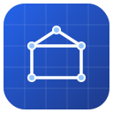

<p align="center">
  
</p>

<h1 align="center">MiniCAD</h1>

<p align="center">
  A small, friendly app for drawing and designing on your computer.
</p>

<p align="center">
  <a href="LICENSE"></a>
  
  
  
</p>

<p align="center">
  
  
  
  
</p>

---

## What is MiniCAD?

MiniCAD is a little program for **drawing things on your computer** — shapes, plans,
and simple designs. Think of it as a digital sheet of graph paper where the lines stay
perfectly straight and the circles stay perfectly round.

You don't need to be an engineer or a programmer to be curious about it. The goal is a
tool that's **easy to open, easy to understand, and works the same** whether you're on
Windows, macOS, or Linux.

> ⚠️ **Heads up:** MiniCAD is in a very early stage. It's a personal hobby project and a
> place to learn — right now there isn't much to *use* yet, but the foundation is being
> built in the open.

## Screenshots

*Coming soon — once there's something pretty to show, it'll go here.* 🖼️

<!--
<p align="center">
  
</p>
-->

## Roadmap

A rough idea of where MiniCAD is headed. Nothing here is set in stone — it's a hobby
project, so things move when there's time and motivation.

- [ ] **The drawing surface** — a window you can pan and zoom around in.
- [ ] **Basic shapes** — draw lines, rectangles, and circles.
- [ ] **Selecting & moving** — click things, move them, delete them.
- [ ] **Snapping & a grid** — so drawings line up neatly.
- [ ] **Save & open** — keep your work in a file and come back to it later.
- [ ] **More tools over time** — measurements, layers, and beyond.

## Building it yourself

MiniCAD isn't packaged for download yet, so for now you run it from the source code.
You'll need the [.NET 10 SDK](https://dotnet.microsoft.com/download) installed.

```bash
git clone https://github.com/Fxbixn03/MiniCAD.git
cd MiniCAD

dotnet run --project src/MiniCAD.App   # build and launch the app
dotnet test                            # run the tests
```

## Contributing

Ideas, bug reports, and pull requests are very welcome — see [CONTRIBUTING.md](CONTRIBUTING.md)
to get started. This project follows the [Contributor Covenant](CODE_OF_CONDUCT.md), so
please be kind. 🙂

## License

MiniCAD is released under the [MIT License](LICENSE) — you're free to use, change, and
share it.
